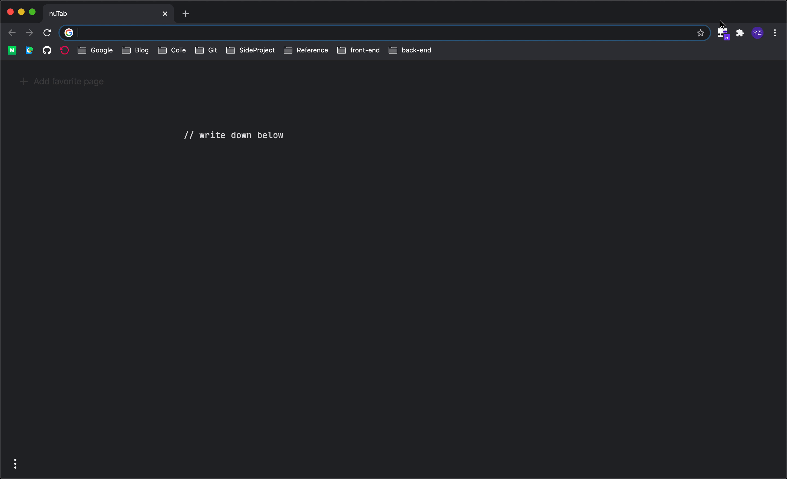
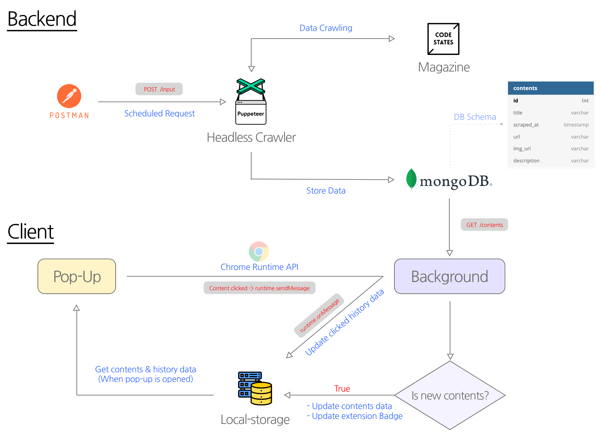

# 크롬 확장프로그램-urclass 매거진

코드스테이츠 매거진 내 콘텐츠의 조회 history를 관리하기 위한 크롬 익스텐션 앱.

## 🌟 App View

 
 

## 📚 Flow

 
 

## 🍿 To-do
- [ ]  배포 시 서버 비용 추정 (DB 데이터 조회 시간 간격 설정)
- [ ]  새로운 콘텐츠 등록 시 알림
- [ ]  알림창 내 "지금 보러가기" / "15분 후에 알림" / "나중에 보기" 추가

 
 

## ✍🏻 Retrospective
- https://cutt.ly/eh5xu3i
